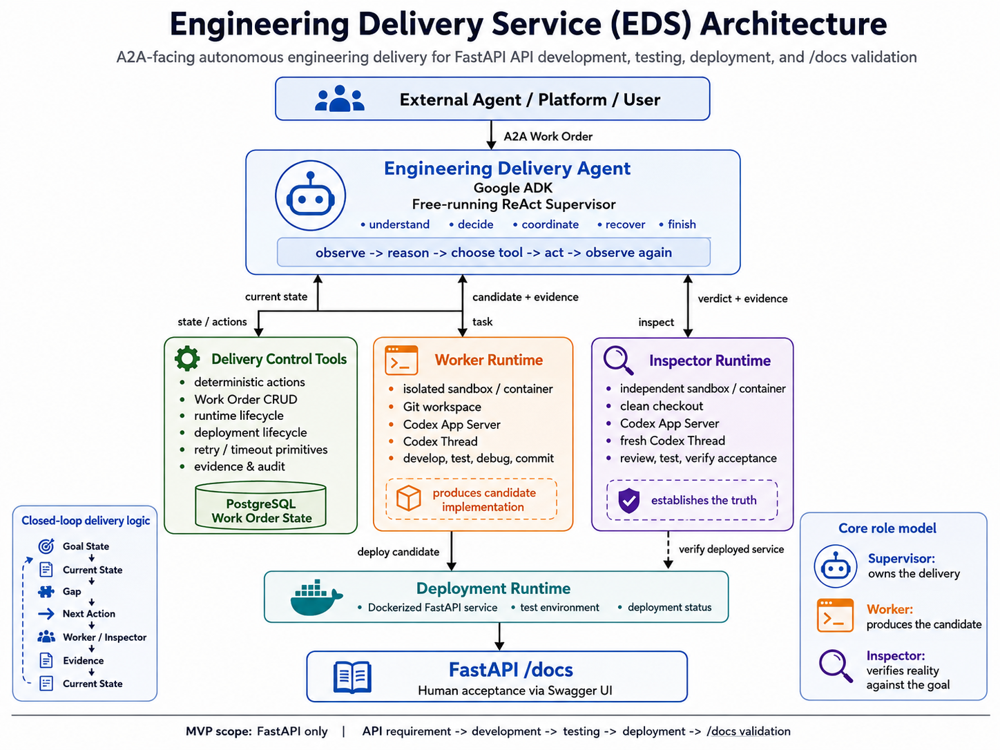

# Engineering Delivery Service (EDS)

**English** · [简体中文](README.zh-CN.md)

An autonomous engineering delivery service. It receives an **Engineering
Work Order** via A2A (not a coding prompt) and drives it autonomously:

```
Requirement → Development → Testing → Inspection → Deployment → Acceptance
```

The caller says *"build and deploy this API"* and gets back a running
service whose `/docs` (Swagger UI) a human can open, "Try it out", and
verify — without ever seeing worker threads, sandboxes, retries, or
inspection loops.

First-release scope: **FastAPI API development and deployment** — a
single repository, explicit acceptance criteria, a containerized test
deployment. The full design lives in
[docs/refer/engineering-delivery-service-architecture.md](docs/refer/engineering-delivery-service-architecture.md)
and the [design doc set](docs/designs/README.md).

## Design

The top-level controller is a free-running **ReAct Supervisor** (Google
ADK). Deterministic **Delivery Control Tools** provide reliable actions
over durable **PostgreSQL** Work Order state. **Worker** and **Inspector**
are full Codex App Server runtimes in separate sandboxes: the Worker
produces a candidate commit; the Inspector independently verifies it
against acceptance criteria and returns ACCEPT / REJECT. The Supervisor
owns the loop.



The same architecture as a text diagram:

```
              External Agent / Platform / User
                              │ A2A
                              ▼
               Engineering Delivery Agent
               (ReAct Supervisor, Google ADK)
                              │
                reason → tool → observe
                              │
        ┌─────────────────────┼─────────────────────┐
        ▼                     ▼                     ▼
 Delivery Control       Worker Runtime        Inspector Runtime
 (tools + durable       (Codex App Server,    (Codex App Server,
  PostgreSQL state)      writable sandbox)     clean sandbox)
        │                     │ candidate           │ verdict
        └─────────────────────┼─────────────────────┘
                              ▼
                      Deployment Runtime
                              ▼
                       FastAPI `/docs`
```

Four principles govern the system:

> **Supervisor owns the delivery.** **Delivery Control provides
> deterministic state and actions.** **Worker produces the candidate.**
> **Inspector establishes the truth.**

The deliberate design judgments behind them:

- **No workflow layer on top.** There is no deterministic pipeline
  deciding what happens next. The highest layer of control is the
  Supervisor's observe → reason → act loop; deterministic code only
  provides reliable actions and state. Judgment ("develop, re-inspect,
  or deploy now?") belongs to the Supervisor.
- **A2A Task ≈ Engineering Work Order, not a Codex turn.** The external
  contract is a whole delivery, so any A2A-compatible caller can submit
  one and poll it to `completed` with artifacts: repository@commit,
  deployment URL, `/docs` URL, test evidence, delivery summary.
- **Nobody marks their own homework.** A Worker's `done` only means the
  candidate is ready for inspection. The Inspector works from an
  independent checkout, without the Worker's reasoning history, and can
  REJECT with evidence that flows back as a fix task.
- **Durable state over conversation memory.** The Work Order, its
  evidence, and its audit trail live in PostgreSQL; the Supervisor
  re-reads state every turn instead of trusting a chat history.
- **Humans accept through the product.** The acceptance floor is the
  delivered API itself — open `/docs`, "Try it out", execute — so no
  extra frontend or dashboard is needed to verify a delivery.

## Roadmap

Every milestone keeps the full chain
`Requirement → Development → Testing → Deployment → /docs` runnable
end-to-end; later milestones add autonomy and reliability, not missing
links (details in [docs/milestones.md](docs/milestones.md)):

| Version | Milestone | What it adds | Status |
|---|---|---|---|
| v0.1 | Single Worker End-to-End | the minimal loop: A2A → Supervisor → Worker → pytest → Docker deploy → live `/docs` | ✅ COMPLETE |
| v0.2 | Durable Delivery Control | restart recovery — work orders survive service restarts and resume; delivery queueing | planned |
| v0.3 | Independent Inspector | the verification half of the design: independent checkout, ACCEPT / REJECT, feedback-driven fixes | planned |
| v0.4 | Requirement Confirmation + HITL | confirmed requirements and acceptance criteria up front; ambiguity resolved through A2A `input-required` | planned |
| v0.5 | Project-aware API Delivery | beyond the template repo: project registry, repository resolution, worktrees, PR delivery | planned |
| v0.6 | Recoverable Autonomous Delivery | crash/retry/resume/rollback, bounded autonomy, escalation to a human | planned |

## Try it

The full loop runs offline — no LLM credential, no Codex login (needs
only [uv](https://docs.astral.sh/uv/) and a Docker daemon):

```bash
uv sync
docker compose up -d postgres && uv run alembic upgrade head

# terminal 1 — EDS in deterministic demo mode:
EDS_SUPERVISOR_BACKEND=deterministic \
EDS_WORKER_SCRIPT=examples/scripted_worker_hello.json \
uv run eds serve

# terminal 2 — submit a requirement and watch it deliver:
uv run eds submit "Add a GET /hello endpoint returning {'hello': 'world'}"
uv run eds status wo-<id> --watch
uv run eds open wo-<id>    # opens the delivered Swagger UI
```

To run it with a real LLM Supervisor and a real Codex Worker, see the
[developer guide](developer-guide.md).

## Repository layout

```
cli.py        `eds` CLI — reference external caller (serve/submit/status/open)
agent/        ReAct Supervisor + prompts + deterministic demo backend
a2a_api/      A2A endpoint (Task ≈ Engineering Work Order)
tools/        Delivery Control tools exposed to the Supervisor
control/      Deterministic state / git / policy primitives
codex/        Codex App Server client + worker/inspector drivers
sandbox/      Sandbox lifecycle (writable worker, clean inspector)
deployment/   Docker deployment runtime
db/           SQLAlchemy models + alembic migrations
docs/         designs/ (design doc set), milestones.md, refer/ (source draft)
```

## Documentation

- [Architecture source draft](docs/refer/engineering-delivery-service-architecture.md) — the original design document EDS is built from
- [Design docs](docs/designs/README.md) — living source of truth: system architecture, A2A interface, supervisor, delivery control, runtimes, work-order state, deployment, delivery protocol
- [Milestones](docs/milestones.md) — the version-driven roadmap (v0.1–v0.6 ↔ M1–M6)
- [Developer guide](developer-guide.md) — setup, running, configuration, tests, development workflow
- [CHANGELOG](CHANGELOG.md) · [v0.1 retrospective](docs/versions/v0.1-single-worker-e2e/retrospect.md)

## Status

| | |
|---|---|
| **Version** | v0.1 — Single Worker End-to-End · ✅ COMPLETE (2026-08-22) |
| **Proven end to end** | `eds` CLI → A2A endpoint → ReAct Supervisor (ADK) → durable PostgreSQL state + Delivery Control tools → Worker (Codex or scripted) → pytest evidence → Docker deployment → live `/docs` — dogfooded with recorded acceptance evidence |
| **Designed, not yet built** | the Inspector runtime and the clarification/recovery machinery land in v0.3–v0.6 (see [Roadmap](#roadmap)) |
| **Known caveat** | the real-model live legs (`pytest -m llm`) skip without LLM credentials — every loop was proven with everything real except the model |

Quality gate: 52/52 checks (`verify_version.py`) · details in the
[CHANGELOG](CHANGELOG.md) and the
[v0.1 retrospective](docs/versions/v0.1-single-worker-e2e/retrospect.md).

## License

[MIT](LICENSE)
